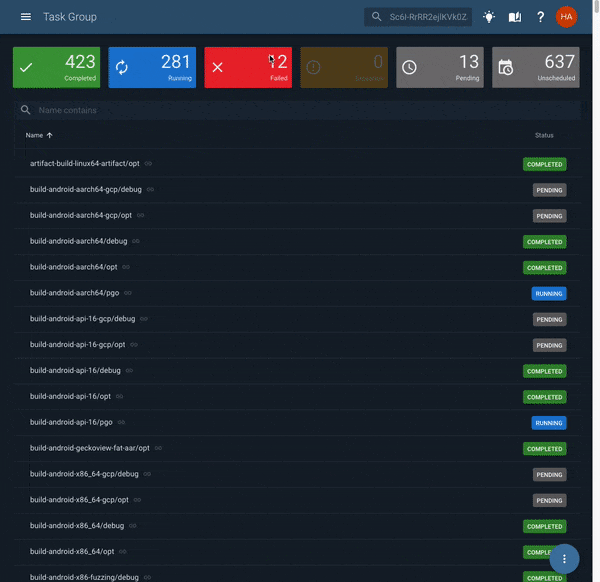

<h1 align="center">
   
  
   
  Taskcluster
   
</h1>

  

<h5 align="center">The task execution framework that supports Mozilla's continuous integration and release processes.</h5>

  
  
  
  

## Usage

This repository is used to develop, build, and release the Taskcluster services.
It is not possible to run a full Taskcluster deployment directly from this repository, although individual services can be run for development purposes.

## Table of Contents

<!-- TOC BEGIN -->
* [Clients](clients#readme)
    * [Taskcluster Client](clients/client#readme)
    * [Taskcluster Client Go](clients/client-go#readme)
    * [Taskcluster Client for Python](clients/client-py#readme)
    * [Taskcluster Client Web](clients/client-web#readme)
* [Deployment Documentation](deployment-docs#readme)
* [Development Documentation](dev-docs#readme)
* [Infrastructure](infrastructure#readme)
    * [Taskcluster Builder](infrastructure/builder#readme)
    * [Docker Images](infrastructure/docker-images#readme)
    * [infrastructure/k8s](infrastructure/k8s#readme)
    * [References](infrastructure/references#readme)
    * [Terraform](infrastructure/terraform#readme)
* [Libraries](libraries#readme)
    * [API Library](libraries/api#readme)
    * [App Library](libraries/app#readme)
    * [Azure Library](libraries/azure#readme)
    * [Config Library](libraries/config#readme)
    * [Iterate Library](libraries/iterate#readme)
    * [Loader Library](libraries/loader#readme)
    * [Monitor Library](libraries/monitor#readme)
    * [Pulse Library](libraries/pulse#readme)
    * [References Library](libraries/references#readme)
    * [Scopes Library](libraries/scopes#readme)
    * [Testing Library](libraries/testing#readme)
    * [Validate Library](libraries/validate#readme)
* [Services](services#readme)
    * [Auth Service](services/auth#readme)
    * [Built-In Workers Service](services/built-in-workers#readme)
    * [GitHub Service](services/github#readme)
    * [Hooks Service](services/hooks#readme)
    * [Index Service](services/index#readme)
    * [Login Service](services/login#readme)
    * [Notify Service](services/notify#readme)
    * [Purge-Cache Service](services/purge-cache#readme)
    * [Queue Service](services/queue#readme)
    * [Secrets Service](services/secrets#readme)
    * [Treeherder Service](services/treeherder#readme)
    * [Web-Server Service](services/web-server#readme)
    * [Worker Manager](services/worker-manager#readme)
* [Taskcluster UI](ui#readme)
    * [ui/src/components/DateDistance](ui/src/components/DateDistance#readme)
    * [ui/src/components/Search](ui/src/components/Search#readme)
    * [ui/src/components/Snackbar](ui/src/components/Snackbar#readme)
    * [ui/src/components/SpeedDial](ui/src/components/SpeedDial#readme)
    * [ui/src/components/StatusLabel](ui/src/components/StatusLabel#readme)
<!-- TOC END -->

## Team Mentions

Do you need to reach a specific subset of the team? Use the team handles to mention us with GitHub's @mention feature.

| Team Name | Use To... |
| --------- | --------- |
| `@taskcluster/Core` | ping members of the Taskcluster team at Mozilla |
| `@taskcluster/services-reviewers` | ping reviewers for changes to platform services and libraries  |
| `@taskcluster/frontend-reviewers` | ping people who can review changes to frontend (and related) code in the services monorepo |
| `@taskcluster/security-folks` | ping people who do security things |

## Contributors

Thanks goes to these wonderful people ([emoji key](https://allcontributors.org/docs/en/emoji-key)):

<!-- ALL-CONTRIBUTORS-LIST:START - Do not remove or modify this section -->
<!-- prettier-ignore -->
<table>
  <tr>
    <td align="center"><a href="https://conduit.vc/"> <b>James Lal</b></a> <a href="https://github.com/taskcluster/taskcluster/commits?author=lightsofapollo" title="Code">💻</a> <a href="#former-staff-lightsofapollo" title="Former Mozilla employee on Taskcluster team">👋</a></td>
    <td align="center"><a href="https://github.com/selenamarie"> <b>Selena Deckelmann</b></a> <a href="https://github.com/taskcluster/taskcluster/commits?author=selenamarie" title="Code">💻</a> <a href="#former-staff-selenamarie" title="Former Mozilla employee on Taskcluster team">👋</a></td>
    <td align="center"><a href="http://code.v.igoro.us/"> <b>Dustin J. Mitchell</b></a> <a href="https://github.com/taskcluster/taskcluster/commits?author=djmitche" title="Code">💻</a> <a href="#staff-djmitche" title="Current Mozilla employee on Taskcluster team">🔧</a></td>
    <td align="center"><a href="https://walac.github.io"> <b>Wander Lairson Costa</b></a> <a href="https://github.com/taskcluster/taskcluster/commits?author=walac" title="Code">💻</a> <a href="#staff-walac" title="Current Mozilla employee on Taskcluster team">🔧</a></td>
    <td align="center"><a href="https://github.com/gregarndt"> <b>Greg Arndt</b></a> <a href="https://github.com/taskcluster/taskcluster/commits?author=gregarndt" title="Code">💻</a> <a href="#former-staff-gregarndt" title="Former Mozilla employee on Taskcluster team">👋</a></td>
    <td align="center"><a href="http://petemoore.github.io/"> <b>Pete Moore</b></a> <a href="https://github.com/taskcluster/taskcluster/commits?author=petemoore" title="Code">💻</a> <a href="#staff-petemoore" title="Current Mozilla employee on Taskcluster team">🔧</a></td>
    <td align="center"><a href="http://hassanali.me"> <b>Hassan Ali</b></a> <a href="https://github.com/taskcluster/taskcluster/commits?author=helfi92" title="Code">💻</a> <a href="#staff-helfi92" title="Current Mozilla employee on Taskcluster team">🔧</a></td>
  </tr>
  <tr>
    <td align="center"><a href="https://imbstack.com"> <b>Brian Stack</b></a> <a href="https://github.com/taskcluster/taskcluster/commits?author=imbstack" title="Code">💻</a> <a href="#staff-imbstack" title="Current Mozilla employee on Taskcluster team">🔧</a></td>
    <td align="center"><a href="https://blog.johnford.org"> <b>John Ford</b></a> <a href="https://github.com/taskcluster/taskcluster/commits?author=jhford" title="Code">💻</a> <a href="#former-staff-jhford" title="Former Mozilla employee on Taskcluster team">👋</a></td>
    <td align="center"><a href="http://eliperelman.com"> <b>Eli Perelman</b></a> <a href="https://github.com/taskcluster/taskcluster/commits?author=eliperelman" title="Code">💻</a> <a href="#former-staff-eliperelman" title="Former Mozilla employee on Taskcluster team">👋</a></td>
    <td align="center"><a href="https://jonasfj.dk/"> <b>Jonas Finnemann Jensen</b></a> <a href="https://github.com/taskcluster/taskcluster/commits?author=jonasfj" title="Code">💻</a> <a href="#former-staff-jonasfj" title="Former Mozilla employee on Taskcluster team">👋</a></td>
    <td align="center"><a href="https://medium.com/@bugzeeeeee/"> <b>owlishDeveloper</b></a> <a href="https://github.com/taskcluster/taskcluster/commits?author=owlishDeveloper" title="Code">💻</a> <a href="#staff-owlishDeveloper" title="Current Mozilla employee on Taskcluster team">🔧</a></td>
    <td align="center"><a href="https://github.com/milescrabill"> <b>Miles Crabill</b></a> <a href="https://github.com/taskcluster/taskcluster/commits?author=milescrabill" title="Code">💻</a> <a href="#staff-milescrabill" title="Current Mozilla employee on Taskcluster team">🔧</a></td>
    <td align="center"><a href="http://coopcoopbware.tumblr.com/"> <b>Chris Cooper</b></a> <a href="https://github.com/taskcluster/taskcluster/commits?author=ccooper" title="Code">💻</a> <a href="#staff-ccooper" title="Current Mozilla employee on Taskcluster team">🔧</a></td>
  </tr>
  <tr>
    <td align="center"><a href="http://grenade.github.io"> <b>Rob Thijssen</b></a> <a href="https://github.com/taskcluster/taskcluster/commits?author=grenade" title="Code">💻</a></td>
    <td align="center"><a href="https://twitter.com/_reznord"> <b>Anup</b></a> <a href="https://github.com/taskcluster/taskcluster/commits?author=reznord" title="Code">💻</a></td>
    <td align="center"><a href="https://hammad13060.github.io"> <b>Hammad Akhtar</b></a> <a href="https://github.com/taskcluster/taskcluster/commits?author=hammad13060" title="Code">💻</a></td>
    <td align="center"><a href="http://ckousik.github.io"> <b>Chinmay Kousik</b></a> <a href="https://github.com/taskcluster/taskcluster/commits?author=ckousik" title="Code">💻</a></td>
    <td align="center"><a href="https://acmiyaguchi.me"> <b>Anthony Miyaguchi</b></a> <a href="https://github.com/taskcluster/taskcluster/commits?author=acmiyaguchi" title="Code">💻</a></td>
    <td align="center"><a href="http://anarute.com"> <b>Ana Rute Mendes</b></a> <a href="https://github.com/taskcluster/taskcluster/commits?author=anarute" title="Code">💻</a></td>
    <td align="center"><a href="http://www.andreadelrio.me"> <b>Andrea Del Rio</b></a> <a href="https://github.com/taskcluster/taskcluster/commits?author=andreadelrio" title="Code">💻</a></td>
  </tr>
  <tr>
    <td align="center"><a href="https://www.kristelteng.com/"> <b>kristelteng</b></a> <a href="https://github.com/taskcluster/taskcluster/commits?author=kristelteng" title="Code">💻</a></td>
    <td align="center"><a href="https://github.com/elenasolomon"> <b>Elena Solomon</b></a> <a href="https://github.com/taskcluster/taskcluster/commits?author=elenasolomon" title="Code">💻</a></td>
    <td align="center"><a href="https://github.com/t0xicCode"> <b>Xavier L.</b></a> <a href="https://github.com/taskcluster/taskcluster/commits?author=t0xicCode" title="Code">💻</a></td>
    <td align="center"><a href="http://yannlandry.com"> <b>Yann Landry</b></a> <a href="https://github.com/taskcluster/taskcluster/commits?author=yannlandry" title="Code">💻</a></td>
    <td align="center"><a href="https://github.com/AyubMohamed"> <b>Ayub</b></a> <a href="https://github.com/taskcluster/taskcluster/commits?author=AyubMohamed" title="Code">💻</a></td>
    <td align="center"><a href="https://github.com/lteigrob"> <b>lteigrob</b></a> <a href="https://github.com/taskcluster/taskcluster/commits?author=lteigrob" title="Code">💻</a></td>
    <td align="center"><a href="https://nextcairn.com"> <b>Bastien Abadie</b></a> <a href="https://github.com/taskcluster/taskcluster/commits?author=La0" title="Code">💻</a></td>
  </tr>
  <tr>
    <td align="center"><a href="https://amjad.io"> <b>Amjad Mashaal</b></a> <a href="https://github.com/taskcluster/taskcluster/commits?author=TheNavigat" title="Code">💻</a></td>
    <td align="center"><a href="https://github.com/tomprince"> <b>Tom Prince</b></a> <a href="https://github.com/taskcluster/taskcluster/commits?author=tomprince" title="Code">💻</a></td>
    <td align="center"><a href="https://github.com/SamanthaYu"> <b>Samantha Yu</b></a> <a href="https://github.com/taskcluster/taskcluster/commits?author=SamanthaYu" title="Code">💻</a></td>
    <td align="center"><a href="https://github.com/auni53"> <b>Auni Ahsan</b></a> <a href="https://github.com/taskcluster/taskcluster/commits?author=auni53" title="Code">💻</a></td>
    <td align="center"><a href="http://alexandrasp.github.io/"> <b>alex</b></a> <a href="https://github.com/taskcluster/taskcluster/commits?author=alexandrasp" title="Code">💻</a></td>
    <td align="center"><a href="https://alisha17.github.io/"> <b>Alisha Aneja</b></a> <a href="https://github.com/taskcluster/taskcluster/commits?author=alisha17" title="Code">💻</a></td>
    <td align="center"><a href="https://github.com/prachi1210"> <b>Prachi Manchanda</b></a> <a href="https://github.com/taskcluster/taskcluster/commits?author=prachi1210" title="Code">💻</a></td>
  </tr>
  <tr>
    <td align="center"><a href="https://github.com/srfraser"> <b>Simon Fraser</b></a> <a href="https://github.com/taskcluster/taskcluster/commits?author=srfraser" title="Code">💻</a></td>
    <td align="center"><a href="https://github.com/ydidwania"> <b>Yashvardhan Didwania</b></a> <a href="https://github.com/taskcluster/taskcluster/commits?author=ydidwania" title="Code">💻</a></td>
    <td align="center"><a href="https://cynthiapereira.com"> <b>Cynthia Pereira</b></a> <a href="https://github.com/taskcluster/taskcluster/commits?author=cynthiapereira" title="Code">💻</a></td>
    <td align="center"><a href="https://github.com/hashi93"> <b>Hashini Galappaththi</b></a> <a href="https://github.com/taskcluster/taskcluster/commits?author=hashi93" title="Code">💻</a></td>
    <td align="center"><a href="https://github.com/fiennyangeln"> <b>Fienny Angelina</b></a> <a href="https://github.com/taskcluster/taskcluster/commits?author=fiennyangeln" title="Code">💻</a></td>
    <td align="center"><a href="https://github.com/kanikasaini"> <b>Kanika Saini</b></a> <a href="https://github.com/taskcluster/taskcluster/commits?author=kanikasaini" title="Code">💻</a></td>
    <td align="center"><a href="https://github.com/Biboswan"> <b>Biboswan Roy</b></a> <a href="https://github.com/taskcluster/taskcluster/commits?author=Biboswan" title="Code">💻</a></td>
  </tr>
  <tr>
    <td align="center"><a href="https://github.com/sudipt1999"> <b>sudipt dabral</b></a> <a href="https://github.com/taskcluster/taskcluster/commits?author=sudipt1999" title="Code">💻</a></td>
    <td align="center"><a href="https://www.linkedin.com/in/ojaswin-mujoo/"> <b>Ojaswin</b></a> <a href="https://github.com/taskcluster/taskcluster/commits?author=OjaswinM" title="Code">💻</a></td>
    <td align="center"><a href="https://github.com/mrrrgn"> <b>Матрешка</b></a> <a href="https://github.com/taskcluster/taskcluster/commits?author=mrrrgn" title="Code">💻</a></td>
    <td align="center"><a href="https://github.com/iFlameing"> <b>Alok Kumar</b></a> <a href="https://github.com/taskcluster/taskcluster/commits?author=iFlameing" title="Code">💻</a></td>
    <td align="center"><a href="https://arshadkazmi42.github.io/"> <b>Arshad Kazmi</b></a> <a href="https://github.com/taskcluster/taskcluster/commits?author=arshadkazmi42" title="Code">💻</a></td>
    <td align="center"><a href="https://github.com/projectyang"> <b>Jason Yang</b></a> <a href="https://github.com/taskcluster/taskcluster/commits?author=projectyang" title="Code">💻</a></td>
    <td align="center"><a href="https://github.com/shubhamgupta2956"> <b>Shubham Gupta</b></a> <a href="https://github.com/taskcluster/taskcluster/commits?author=shubhamgupta2956" title="Code">💻</a></td>
  </tr>
  <tr>
    <td align="center"><a href="https://github.com/arku"> <b>Arun Kumar Mohan</b></a> <a href="https://github.com/taskcluster/taskcluster/commits?author=arku" title="Code">💻</a></td>
  </tr>
</table>

<!-- ALL-CONTRIBUTORS-LIST:END -->

This project follows the [all-contributors](https://github.com/all-contributors/all-contributors) specification. Contributions of any kind welcome!
