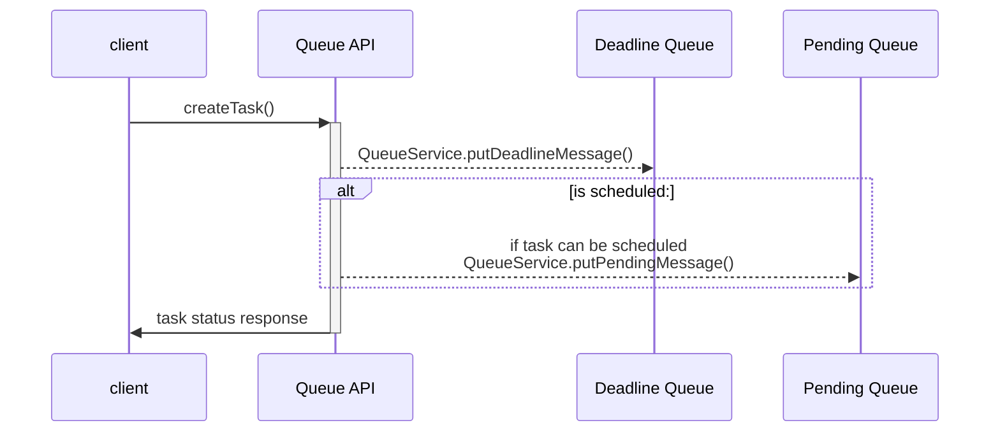
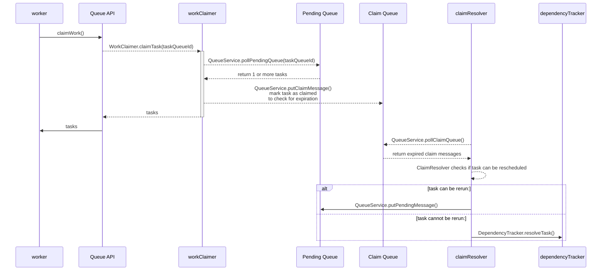
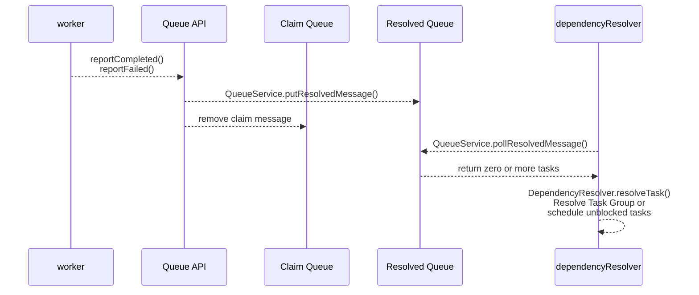

# Queue Service

This service is the central process coordinating execution of tasks in the Taskcluster setup.

## Development

No special configuration is required for development.

Run `yarn workspace taskcluster-queue test` to run the tests.
Some of the tests will be skipped without additional credentials, but it is fine to make a pull request as long as no tests fail.

To run _all_ tests, you will need appropriate Taskcluster credentials.
Using [taskcluster-cli](https://github.com/taskcluster/taskcluster-cli), run `eval $(taskcluster signin --scope assume:project:taskcluster:tests:taskcluster-queue)`, then run the tests again.

To run even more tests you'll need a configuration file with access credentials for S3 and Azure Blob and Table Storage, as well as pulse credentials.
To do this, create a local configuration file `user-config.yml` in `services/queue`.
For safety reasons, this file is added to the `.gitignore` file.
There is an example `user-config-example.yml` to use for initial setup.

For S3 we have a dummy bucket called `test-bucket-for-any-garbage` which stores objects for 24 hours.
Mozilla developers can get access from a taskcluster developer, or you can setup a custom a bucket and overwrite the bucket name as well as the credentials.

Same thing applies for azure, though it's not as nicely scoped, and doesn't clean up on its own.

## Queue internals

Queue service is using internal queues to manage task lifecycle. Those are:

- pending queue - scheduled tasks ready to be claimed
- claim queue - tasks that were claimed, and are awaiting to be resolved or failed with `claim-expired`
- deadline queue - task deadlines, to help resolve task graph dependencies if task was not resolved in time
- resolve queue - short-lived queue to resolve task graph dependencies

Interactions with those queues are handled in [`QueueService`](./src/queueservice.js).

### Create task

When task is created it can either be scheduled right away (no unmet dependencies) or it can stay unscheduled.

### Worker claiming work

Workers would be calling `queue.claimWork()` to get tasks from specific `taskQueueId`.

### Tasks being resolved

Before task deadline, tasks can be resolved by calling `queue.reportCompleted()`, `queue.reportFailed()` or `queue.reportException()`.

`DepnedencyResolver` will be notified about resolved tasks and will try to resolve task graph dependencies.

