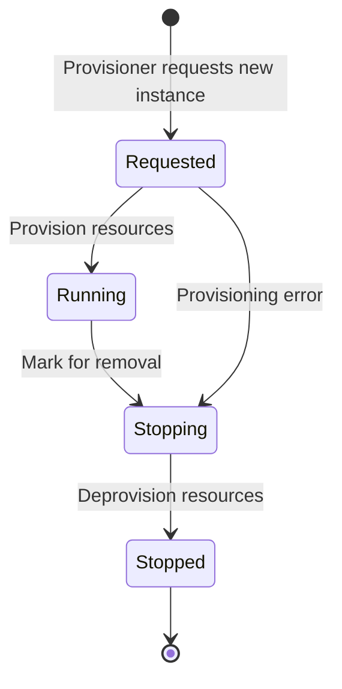
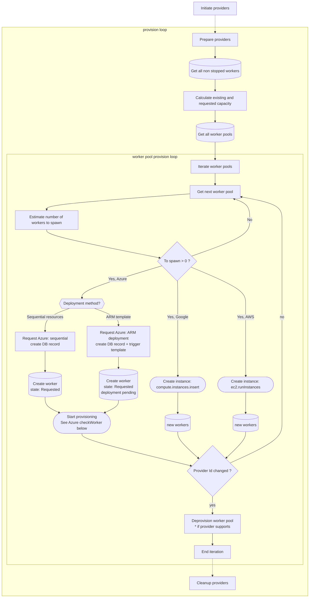
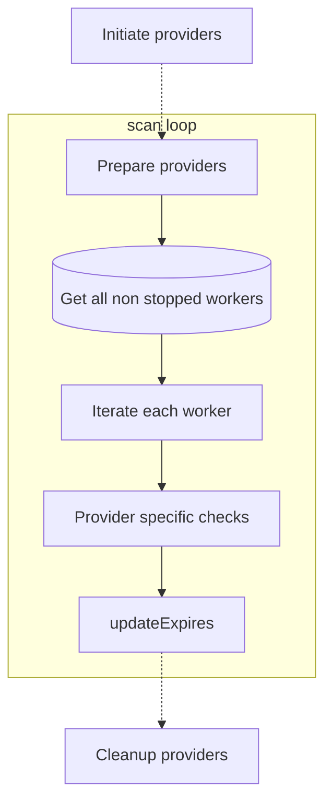
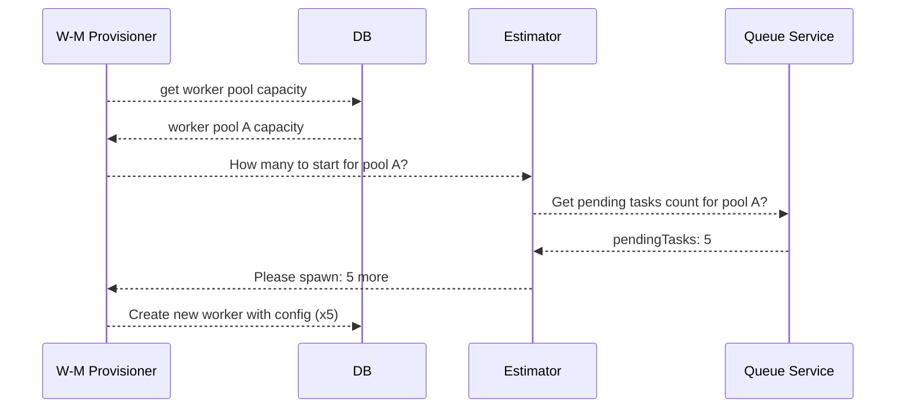
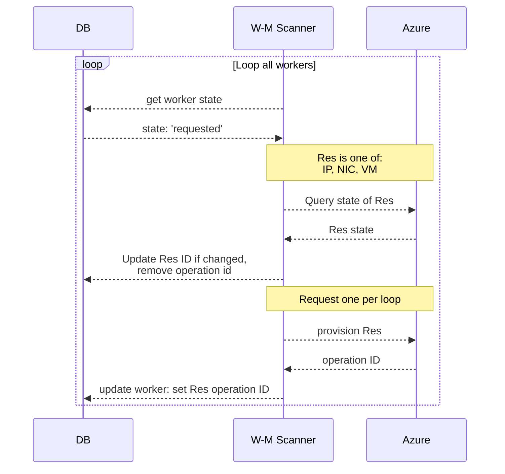
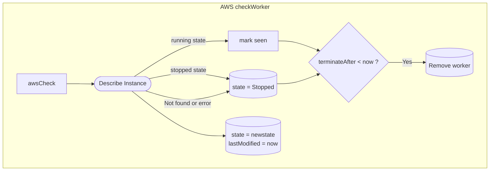
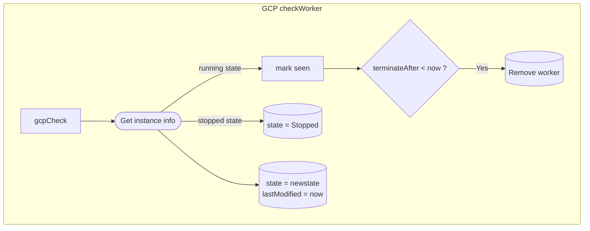

# Worker Manager Service

The worker manager service manages workers, including interacting with cloud services to create new workers on demand.

## Development

No special configuration is required for development.

Run `yarn workspace @taskcluster/worker-manager test` to run the tests.
Some of the tests will be skipped without additional credentials, but it is fine to make a pull request as long as no tests fail.

To run *all* tests, you will need appropriate Taskcluster credentials.
Using [taskcluster-cli](https://github.com/taskcluster/taskcluster-cli), run `eval $(taskcluster signin --scope assume:project:taskcluster:tests:taskcluster-worker-manager)`, then run the tests again.

## Implementing Providers

See [docs/providers.md](docs/providers.md) for details on implementing providers.

## Testing

Azure tests rely on valid `test/fixtures/azure_signature_good.json` file that can be obtained by running a VM inside Azure cloud to fetch [attested metadata](https://docs.microsoft.com/en-us/azure/virtual-machines/windows/instance-metadata-service?tabs=linux#attested-data). This JSON file contains both the document (signature) and vmId in a single place, eliminating the need to maintain these values separately.

```sh
# sudo apt update && sudo apt install jq

# obtain new signature document for `azure_signature_good.json`
curl -H Metadata:true --noproxy "*" "http://169.254.169.254/metadata/attested/document?api-version=2021-05-01" | jq -r .signature

# obtain vmId to include in the JSON file
curl -H Metadata:true --noproxy "*" "http://169.254.169.254/metadata/instance?api-version=2021-05-01" | jq -r .compute.vmId

# Create or update azure_signature_good.json with both values
# The file should have this format:
# [
#   {
#     "document": "<signature-string>",
#     "vmId": "<vm-id>",
#     "notes": "expiration date and other info"
#   }
# ]
```

Note: new signature might be signed by one of the two intermediate certificates (`azure/azure-ca-certs/microsoft_rsa_tls_ca_[12].pem`). This is important for `test/provider_azure_test.js` as it relies on the intermediate cert to do proper tests.

Another way would be to create a task in one of the Azure worker pools with the following payload and parse logs to get the document:

```yaml
  command:
  - >-
    powershell -Command "(Invoke-WebRequest -UseBasicParsing -Headers
    @{Metadata='true'} -Uri
    'http://169.254.169.254/metadata/attested/document?api-version=2021-05-01').Content"
  - >-
    powershell -Command "(Invoke-WebRequest -UseBasicParsing -Headers
    @{Metadata='true'} -Uri
    'http://169.254.169.254/metadata/instance?api-version=2021-05-01').Content"
```

<details>
<summary>Steps to find out which intermediate certificate is used</summary>
To find out which intermediate cert is used:

```sh
# Extract the document from the JSON file
jq -r '.[0].document' azure_signature_good.json > azure_signature_encoded

# Decode the signature
base64 -d -i azure_signature_encoded > decodedsignature
# Get PKCS7 format
openssl pkcs7 -in decodedsignature -inform DER -out sign.pk7
# Get Public key out of pkc7
openssl pkcs7 -in decodedsignature -inform DER  -print_certs -out signer.pem
# Get the intermediate certificate
curl -s -o intermediate.cer "$(openssl x509 -in signer.pem -text -noout | grep " CA Issuers -" | awk -FURI: '{print $2}')"
openssl x509 -inform der -in intermediate.cer -out intermediate.pem
# Verify the contents
openssl smime -verify -in sign.pk7 -inform pem -noverify

# Verify the subject name for the main certificate
openssl x509 -noout -subject -in signer.pem
# Verify the issuer for the main certificate
openssl x509 -noout -issuer -in signer.pem

#Validate the subject name for intermediate certificate
openssl x509 -noout -subject -in intermediate.pem
#Validate the fingerprint for intermediate certificate
openssl x509 -noout -fingerprint -in intermediate.pem
# Verify the issuer for the intermediate certificate
openssl x509 -noout -issuer -in intermediate.pem

# Check expiry dates
openssl x509 -noout -enddate -in signer.pem
openssl x509 -noout -enddate -in intermediate.pem
```

Last three lines would contain the values that should match `intermediateCertFingerprint`, `intermediateCertSubject`, `intermediateCertIssuer`, `intermediateCertPath` variables in `test/provider_azure_test.js`.
</details>

## Worker Manager lifecycle

Worker manager consists of two running processes - provisioner and scanner.

### Worker states



### Worker manager provisioning loop

Provisioner checks all available providers and queue capacity in order to make a decision if new workers are needed for each worker pool.



### Worker manager scanning loop

Scanner iterates through all non-stopped workers to check and update their statuses.



#### Sequence of calls



#### Azure specific checks

```mermaid
graph TD;

  subgraph azureCheckWorker [Azure checkWorker]
    azureCheckStates --> isStopping{state == Stopping ?}
    isStopping -- Yes --> deprovisionResources[Deprovision resources]
    isStopping -- No --> isARMTemplate{deploymentMethod<br>== arm-template ?}
    isARMTemplate -- Yes --> checkArmDeployment[checkARMDeployment()]
    checkArmDeployment -- returns false --> azureCheckEnd
    checkArmDeployment -- returns true --> queryInstance([Cloud API: get instance info])
    isARMTemplate -- No --> queryInstance

    queryInstance -- VM exists --> checkTerminateAfter{terminateAfter < now ?}
    checkTerminateAfter -- Yes --> removeWorker[(Remove worker)]
    checkTerminateAfter -- No --> provisionResources([Provision resources])

    queryInstance -- VM stopped or failed ? ----> removeWorker

    queryInstance -- VM not found --> isRequestedAndNotProvisioned{Requested but <br>not yet provisioned ?}
    isRequestedAndNotProvisioned -- Yes ----> provisionResources
    isRequestedAndNotProvisioned -- No ----> removeWorker

    subgraph Deprovisioning
      deprovisionResources --> deleteDeployment{deploymentMethod<br>== arm-template ?}
      deleteDeployment -- Yes --> deprovisionArmDeployment([Delete ARM deployment])
      deleteDeployment -- No --> skipDeployment[skip]
      (deprovisionArmDeployment & skipDeployment) --> deprovisionVm([Deprovision VM])
      deprovisionVm --> deprovisionNic([Deprovision NIC])
      deprovisionNic --> deprovisionIp([Deprovision IP])
      deprovisionIp --> deprovisionDisks([Deprovision all disks])
      deprovisionDisks --> markStopped[(state = Stopped)]
    end
    markStopped --> azureCheckEnd

    subgraph Provisioning
      provisionResources -- if public IP needed --> provisionIp[/Provision IP async/]
      provisionResources -- if public ip not needed --> provisionNic
      provisionIp -- if ip ready --> provisionNic[/Provision NIC/]
      provisionNic -- if nic ready --> provisionVm[/Provision VM/]
      provisionVm -- success --> provisionComplete[(provisioningComplete = true)]
    end
    provisionVm -- failure --> removeWorker
    provisionVm --> azureCheckEnd

    removeWorker --> azureCheckEnd[end of check]
  end
```

#### Sequence of provisioning



#### AWS specific checks



#### GCP specific checks


